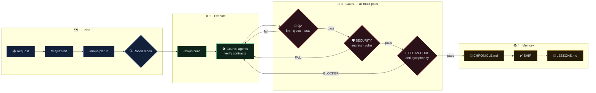

<div align="center">

[](USAGE_AR.md)
[](USAGE_EN.md)
[](USAGE_ZH.md)

# 🏛️ MAJLIS · The Council — المجلس

### **One mind. Every tool. — عقلٌ واحد في كل أدواتك — 一个大脑，贯通所有工具**


**A disciplined council of 40 real agents and 90 curated skills — installed with one command into OpenCode, Claude Code, Codex, Gemini CLI and 26+ more platforms. Nothing ships without test evidence and a green security gate.**

`pnpm dlx majlis-council --all` &nbsp; *(or: `npx majlis-council --all`)*

</div>

---

## 📖 Table of Contents
[Install](#-installation) · [Council](#-the-council-of-forty) · [Commands](#-six-governing-commands) · [Pipeline](#-the-pipeline) · [Skills](#-skills-90--trilingual) · [Security](#-the-red-gate) · [Self-Heal](#-self-healing-updates) · [Platforms](#-platforms) · [Publish](#-publish-your-own-copy) · [Integrity](#-integrity)

---

## 📦 Installation

| Goal | Command |
|---|---|
| **Everything (pnpm standard)** | `pnpm dlx majlis-council --all` |
| Fallback (npx) | `npx majlis-council --all` |
| Single platform | `pnpm dlx majlis-council --claude` · `--codex` · `--opencode` · `--gemini` · `--universal` |
| Project scaffold (Cursor/Windsurf/Copilot…) | `pnpm dlx majlis-council --scaffold <project-path>` |
| From source (Windows) | `powershell -File install_system.ps1` |

---

## 🏛️ The Council of Forty

> Full bilingual roster with divisions, roles and reference skills → **[COUNCIL.md](COUNCIL.md)**

| Division | Members |
|---|---|
| 👑 **Command & Strategy** | `@hadi-core` · `@hadi-maestro` · `@product-shaper` |
| 🔍 **Recon & Risk** | `@rased-explorer` · `@risk-assessor` · `@incident-detective` |
| ⚙️ **Engineering** | `@emad-api-shield` · `@data-modeler` · `@integrative-architect` · `@stream-partitioner` · `@dep-manager` · `@cicd-automator` · `@sandbox-isolator` · `@motion-coder` · `@data-engineer` · `@release-manager` |
| 🛡️ **Quality & Security** | `@sareem-security` · `@baher-qa` · `@nadif-clean-code` · `@code-polisher` · `@test-engineer` · `@perf-auditor` · `@a11y-auditor` |
| 🎨 **Experience & Identity** | `@bayan-diagrams` · `@design-system-master` · `@responsive-layout` · `@ux-researcher` · `@brand-guardian` · `@print-publisher` · `@growth-analyst` · `@cinematic-director` |
| 📚 **Knowledge & Ops** | `@sajeel-logger` · `@hakim-mentor` · `@balegh-docs` · `@mubtakir-tools` · `@agent-weaver` · `@prompt-smith` · `@context-steward` · `@portfolio-steward` · `@voice-engineer` |

---

## ⚡ Six Governing Commands

Native per platform — OpenCode `/majlis-start` · Claude `/majlis-start` · Codex `/prompts:majlis-start` · Gemini `/majlis:start` · elsewhere: *"run majlis start"*.

| Command | Does | Enforced gate |
|---|---|---|
| `/majlis:start` | Guided init → `.majlis/` PROJECT + ROADMAP + STATE | — |
| `/majlis:plan <n>` | Wave decomposition with runnable `verify:` contracts | no-verify plans **rejected** |
| `/majlis:build` | Parallel waves via proper agents · atomic commits | forbidden globs · verify passes |
| `/majlis:review` | 2–4 reviewer panel · anti-sycophancy rubrics | BLOCKER bounces (≤3 cycles) |
| `/majlis:security` | TruffleHog → Nuclei → OWASP ZAP → manual audit | **SECURITY: PASS** mandatory |
| `/majlis:status` | Dashboard + exact next action | read-only |

---

## 🔄 The Pipeline



---

## 🧠 Skills (90 · Trilingual)

> Every skill with **English · العربية · 中文** descriptions → **[SKILLS_CATALOG.md](SKILLS_CATALOG.md)**

| Category | Count | Highlights |
|---|---|---|
| 🛡️ Security Pipeline | 5 | trufflehog · nuclei · owasp-zap · clean-code · k6 |
| 🏛️ Council Playbooks | 20 | orchestration · chronicle · audit360 · architect… |
| 🔬 Science Databases | 35 | uniprot · pubmed · ensembl · gnomad · alphafold… |
| 🎨 Creative Production | 13 | remotion · gsap · design-system · polish… |
| ☁️ Cloudflare | 14 | workers · wrangler · durable-objects · turnstile… |
| 🧰 System Meta | 3 | majlis-rules · antigravity-sdk · uv |

Invoke: OpenCode/Claude auto-discover · Codex `$skill-name` · others: read `SKILL.md`.

---

## 🚨 The Red Gate

The signature nobody else ships: an **offensive security pipeline before every delivery** —
`TruffleHog` secrets sweep → `Nuclei` config exposure → `OWASP ZAP` API defenses → human-grade audit → binary verdict.
**`SECURITY: FAIL` freezes everything until blockers die.**

---

## 🔄 Self-Healing Updates

Edit package → bump `VERSION.txt` → next OpenCode launch redeploys **all platforms in ~0.5s, silently**.
Damaged installs repair themselves. Log: `~/.config/opencode/.majlis_bootstrap.log`.

---

## 🌐 Platforms

| Tier | Platforms | You get |
|---|---|---|
| 🟢 Native agents | OpenCode · Claude Code | 40 subagents · slash commands · auto skills |
| 🟡 Prompt-native | Codex · Gemini CLI | `$skills` · `/prompts:majlis-*` · `/majlis:*` |
| 🔵 Rules + universal | Cursor · Windsurf · Copilot · Antigravity · Kilo · Aider · +26 | scaffold pointers · `~/.agents/skills` |

---

## 🚀 Publish your own copy

```bash
cd npm
# edit package.json name/scope once
pnpm publish       # (or: npm publish) -> world runs: pnpm dlx majlis-council --all
```

---

## ✅ Integrity

Automated reality-check (source + 4 deploy targets + landing references):
**1728 checks passing · 0 failures.** Rerun anytime: `node eval/run.js`

---

<div align="center">

**MIT** · 🏛️ Majlis Council · *Hunt first. Ship clean.* · اصطد أولاً، وانشر نقياً

[⭐ Star this repo](https://github.com/1stANUNNAKI/majlis) if the Council serves you well

</div>
